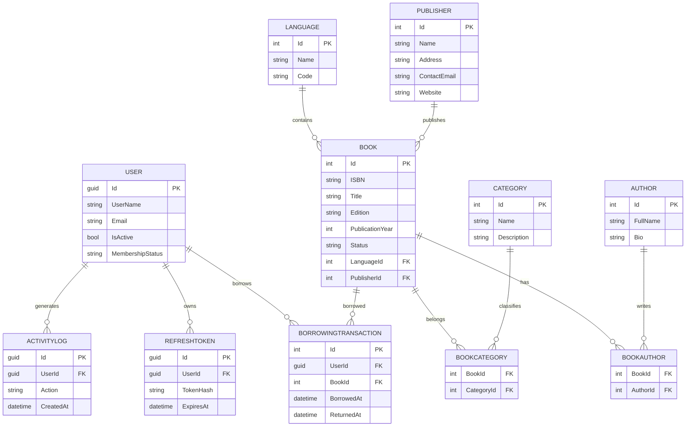

# Library Management System API

A comprehensive RESTful API for managing library operations, built with ASP.NET Core, Entity Framework Core, PostgreSQL, and ASP.NET Identity. The system provides secure authentication, role management, catalog management, borrowing transactions, audit logging, and scalable architecture following Clean/Layered Architecture principles.

---

# Quick Start

## Clone Repository

```bash
git clone https://github.com/Abdallah85/LibraryManagementSystem.git

cd LibraryManagementSystem
```

## Restore Dependencies

```bash
dotnet restore
```

## Configure Database

Edit `appsettings.json`:

```json
{
  "ConnectionStrings": {
    "DefaultConnection": "Host=localhost;Port=5432;Database=LibraryDb;Username=postgres;Password=postgres"
  },

  "Jwt": {
    "Secret": "YOUR_32_CHARACTER_SECRET_KEY",
    "Issuer": "LibrarySystem",
    "Audience": "LibrarySystemClient"
  }
}
```

## Run Application

```bash
dotnet run --project LibraryManagementSystem
```

---

# Application URLs

| Service | URL |
|----------|------|
| HTTP | http://localhost:5167 |
| HTTPS | https://localhost:7152 |
| Swagger UI | https://localhost:7152/swagger/index.html |

---

# Technology Stack

| Category | Technology |
|-----------|-------------|
| Backend | ASP.NET Core |
| Database | PostgreSQL |
| ORM | Entity Framework Core |
| Authentication | ASP.NET Identity + JWT |
| Documentation | Swagger/OpenAPI |
| Architecture | Layered Architecture |
| Containerization | Docker |

---

# Architecture Overview

```text
┌───────────────────────────────────────┐
│             Presentation              │
│          Controllers / APIs           │
└───────────────────────────────────────┘
                    │
                    ▼
┌───────────────────────────────────────┐
│              Services                 │
│           Business Logic              │
└───────────────────────────────────────┘
                    │
                    ▼
┌───────────────────────────────────────┐
│               Domain                  │
│ Entities / Enums / Exceptions         │
└───────────────────────────────────────┘
                    │
                    ▼
┌───────────────────────────────────────┐
│            Persistence                │
│ EF Core / Repositories / UoW          │
└───────────────────────────────────────┘
                    │
                    ▼
             PostgreSQL
```

---

# Solution Structure

| Project | Responsibility |
|----------|---------------|
| LibraryManagementSystemApi | Application startup & configuration |
| Presentation | API Controllers |
| Services | Business Logic |
| ServicesAbstractions | Interfaces |
| Domain | Entities and Models |
| Persistence | EF Core, Repositories, DbContext |
| Shared | DTOs and Shared Models |

---

# Database Initialization

The application automatically:

- Creates the database
- Applies migrations
- Seeds default roles

Simply run:

```bash
dotnet run
```

---

# Seeded Roles

| Role |
|--------|
| Administrator |
| Librarian |
| Staff |
| Member |

---

# Authentication Flow

## Register

```http
POST /api/auth/register
```

### Request

```json
{
  "username": "john_doe",
  "email": "john@example.com",
  "password": "SecurePass123!"
}
```

### Response

```json
{
  "success": true,
  "message": "Registration successful",
  "data": {
    "accessToken": "...",
    "refreshToken": "...",
    "userId": "...",
    "username": "john_doe",
    "role": "Member"
  }
}
```

---

## Login

```http
POST /api/auth/login
```

---

## Refresh Token

```http
POST /api/auth/refresh-token
```

---

# JWT Configuration

| Setting | Value |
|-----------|---------|
| Algorithm | HS256 |
| Access Token Expiration | 15 Minutes |
| Refresh Token Expiration | 7 Days |
| Storage | Hashed in Database |

---

# Swagger Authentication

1. Open Swagger UI
2. Click **Authorize**
3. Enter:

```text
Bearer YOUR_ACCESS_TOKEN
```

4. Execute secured endpoints

---

# API Endpoints

## Authentication

| Method | Endpoint |
|----------|------------|
| POST | /api/auth/register |
| POST | /api/auth/login |
| POST | /api/auth/refresh-token |

---

## Categories

| Method | Endpoint |
|----------|------------|
| POST | /api/categories |
| GET | /api/categories |
| GET | /api/categories/{id} |
| PUT | /api/categories/{id} |
| DELETE | /api/categories/{id} |

---

## Languages

| Method | Endpoint |
|----------|------------|
| POST | /api/languages |
| GET | /api/languages |
| GET | /api/languages/{id} |
| PUT | /api/languages/{id} |
| DELETE | /api/languages/{id} |

---

## Publishers

| Method | Endpoint |
|----------|------------|
| POST | /api/publishers |
| GET | /api/publishers |
| GET | /api/publishers/{id} |
| PUT | /api/publishers/{id} |
| DELETE | /api/publishers/{id} |

---

# Database Schema

## Main Entities

### User

```text
Id
UserName
Email
PasswordHash
IsActive
MembershipStatus
```

### Book

```text
Id
ISBN
Title
Edition
PublicationYear
Status
LanguageId
PublisherId
```

### Author

```text
Id
FullName
Bio
```

### Category

```text
Id
Name
Description
```

### Language

```text
Id
Name
Code
```

### Publisher

```text
Id
Name
Address
ContactEmail
Website
```

### BorrowingTransaction

```text
Id
UserId
BookId
BorrowedAt
ReturnedAt
```

### RefreshToken

```text
Id
UserId
TokenHash
ExpiresAt
```

### ActivityLog

```text
Id
UserId
Action
CreatedAt
```

---

# Database ERD



---

# Validation Rules

## Register User

| Field | Validation |
|---------|-----------|
| Username | Required, 3-100 chars |
| Email | Valid Email |
| Password | Minimum 8 chars |

Password must contain:

- Uppercase letter
- Lowercase letter
- Number
- Special character

---

# Error Response Format

```json
{
  "errorCode": "NOT_FOUND",
  "message": "Category not found",
  "details": null,
  "traceId": "xxxx",
  "timestamp": "2026-01-20T12:30:45Z"
}
```

---

# HTTP Status Codes

| Code | Meaning |
|--------|----------|
| 400 | Bad Request |
| 401 | Unauthorized |
| 403 | Forbidden |
| 404 | Not Found |
| 409 | Conflict |
| 500 | Internal Server Error |

---

# Security Features

Implemented:

- ASP.NET Identity Password Hashing
- JWT Authentication
- Refresh Token Rotation
- HTTPS Enforcement
- SQL Injection Protection
- Soft Delete Support
- Audit Logging

---

# Docker

## Build

```bash
docker build -t library-management-api .
```

## Run

```bash
docker run -d \
-p 8080:8080 \
-p 8081:8081 \
--name library-api \
library-management-api
```

---


# License

See LICENSE file for details.